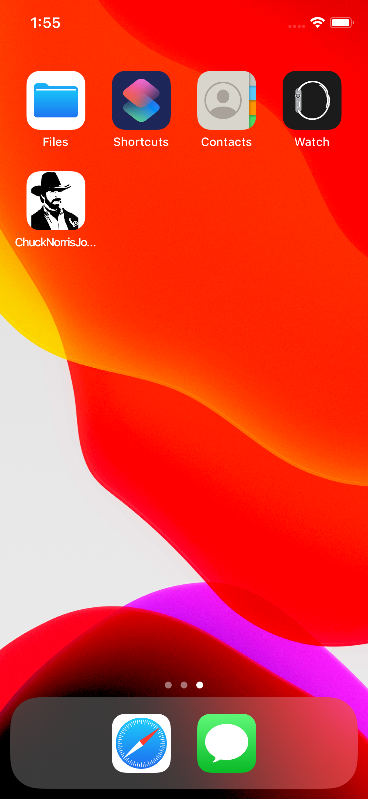
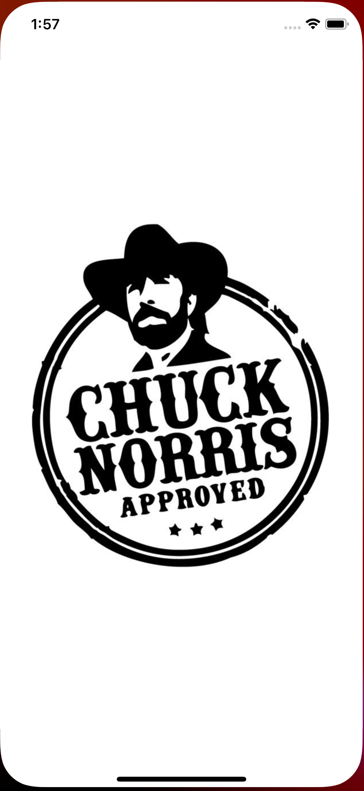
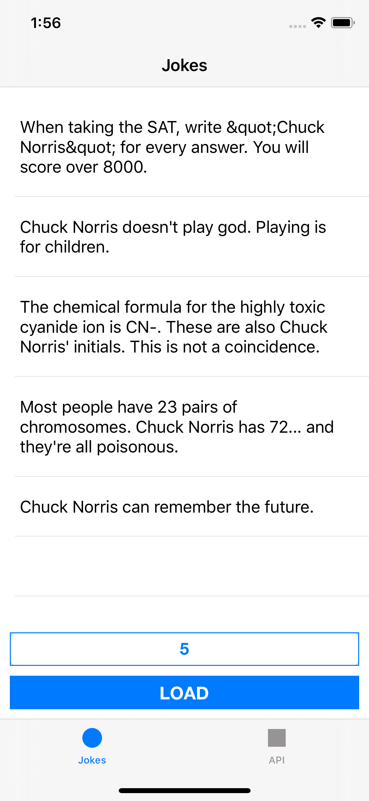
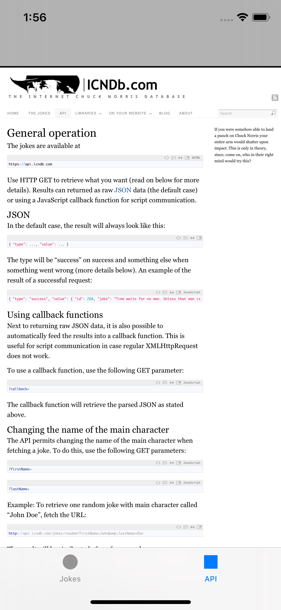

# App with jokes about Chuck Norris

  English |
  <a href="README.ru-RU.md">Russian</a> 

## The assignment

* Develop a mobile app for iOS
* Minimum supported iOS version 10
* The language of development does not matter
* You can use any existing frameworks
* Customization of the design is allowed (and will be a plus), but the overall concept of the app must be preserved

## Description

Mobile app with jokes about Chuck Norris. Bottom navigation menu include two tabs:
* On the first tab, the user enters the desired number of jokes and presses LOAD. Jokes about Chuck Norris are uploaded from the server to the list at the top of the screen.
* On the second tab, the API documentation web-page should be present.

## The advantages

* Use popular frameworks to work with the server
* Clean and readable code (SOLID)

## Additional information

* A link to the documentation: http://www.icndb.com/api/
